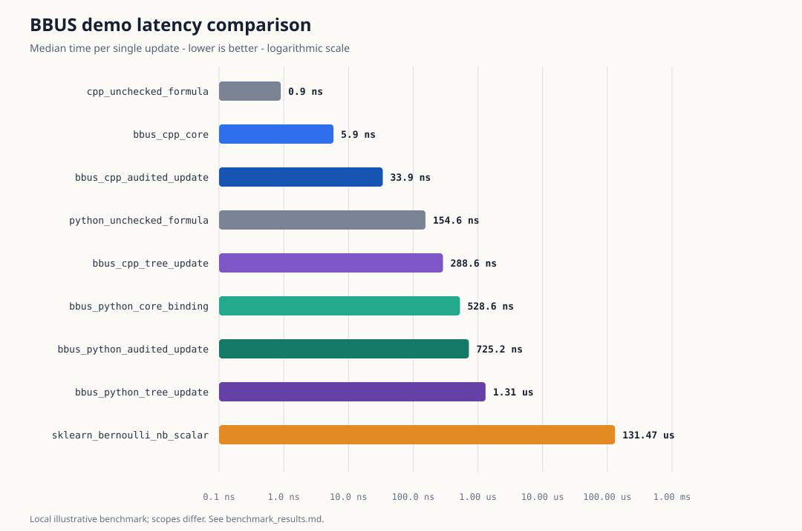

# belief-update

A deterministic, auditable, and stress-testable Bayesian belief-update library
for real-time systems.

This is not a general probabilistic-programming framework. It implements a
small binary Bayesian update pipeline with explicit inputs, typed provenance,
deterministic replay, focused analysis, and thin Python bindings.

## Workflow

```text
construct inputs -> validate -> update -> inspect result -> optionally analyze
```

`update` always performs validation and resolution again. Calling `Validator`
first is useful when an application needs to inspect a typed accept, warn, or
reject decision before attempting the update.

```python
import belief_update

configuration = belief_update.UpdateConfig(freshness_rule=None)
timestamp = belief_update.ProvenanceTimestamp(unix_nanoseconds=1_000)
likelihood_input = belief_update.LikelihoodInput(
    likelihoods=belief_update.LikelihoodValues(
        evidence_given_hypothesis=0.8,
        evidence_given_not_hypothesis=0.2,
    ),
    evidence_weight=None,
    provenance=belief_update.Provenance(
        source_type=belief_update.SourceType.human,
        source_id=belief_update.SourceId(value="analyst-7"),
        version=belief_update.SourceVersion(value="1"),
        timestamp=timestamp,
        confidence=0.9,
        override_status=belief_update.OverrideStatus.requested,
    ),
)
inputs = belief_update.UpdateInputs(
    prior=belief_update.BeliefState(probability=0.4),
    explicit_override=likelihood_input,
    likelihood_model_value=None,
    evaluation_time=timestamp,
)

validation = belief_update.Validator(
    configuration=configuration
).validate_input(likelihood_input, timestamp)
if not validation.can_proceed:
    raise ValueError(validation.code)

result = belief_update.update(
    inputs=inputs,
    configuration=configuration,
    algorithm=belief_update.UpdateAlgorithm.exact_binary,
)
print(result.posterior)

sensitivity = belief_update.local_sensitivity(result=result)
```

Convenience calls use exact binary Bayes and a fixed configuration with no
freshness rule:

```python
result = belief_update.update(
    prior=0.4,
    p_e_given_h=0.8,
    p_e_given_not_h=0.2,
)

result = belief_update.update(prior=0.4, likelihood_model=model)
```

The scalar form records deterministic direct-input provenance: source type
`direct_input`, source id `belief_update.direct`, version `0.0.3`, timestamp
zero, confidence `1.0`, and override status `applied`. The model form preserves
the model output and uses its provenance timestamp as the evaluation time.

## Behavior

- The real-time path is `validate -> resolve -> update -> result`.
- Input precedence is `explicit override > validated model value > error`.
- Probabilities must be finite and in `[0, 1]`.
- Orchestrated likelihood ratios must be finite and strictly positive.
- Validation observes inputs and never rewrites, clips, substitutes, or
  down-weights them.
- Confidence and optional evidence weight are recorded metadata; neither changes
  the posterior.
- Freshness checks occur only when configured explicitly. A warning permits the
  update and is recorded without changing its posterior.
- `UpdateResult` is immutable and contains the inputs, selected provenance,
  configuration, algorithm, intermediate calculations, warnings, and library
  version needed for deterministic replay.
- Stress testing requires caller-supplied ranges, calls the C++ Bayesian core,
  and remains outside the real-time dependency path.
- Local sensitivity, model-versus-explicit comparison, threshold analysis, and
  stress testing consume an existing immutable result.

The C++ core implements exact binary and log-odds updates. Python calls those
production C++ functions through pybind11. The pure-Python implementation under
`tests/python/` is a verification oracle only and is not packaged.

See [architecture](docs/architecture.md), [analysis conventions](docs/analysis.md),
and [misleading-posterior behavior](docs/misleading_posteriors.md) for the
detailed contracts.

## Build and test

Requirements: CMake 3.25 or newer, a C++20 compiler, and Python 3.9 or newer.
The only non-standard build dependencies are checksum-pinned pybind11 3.1.0 and
scikit-build-core 0.11.6.

```sh
cmake --preset release
cmake --build --preset release
ctest --preset release
```

Focused release checks:

```sh
ctest --preset release -L replay
ctest --preset release -L golden
ctest --preset release -L "stress|analysis"
```

Build the Python wheel:

```sh
python3 -m pip wheel . --no-deps
```

## Demo and benchmark

The [demo guide](demo/README.md) contains complete C++ and Python examples,
reproducible benchmark commands, and an optional scikit-learn comparison. The
benchmark generates CSV, Markdown, and SVG results without adding plotting or
machine-learning dependencies to the library itself.



The plot uses a logarithmic scale and labels results in nanoseconds (`ns`),
microseconds (`us`), or milliseconds (`ms`). See the demo guide for the exact
commands, environment, raw results, and scope of each comparison.
